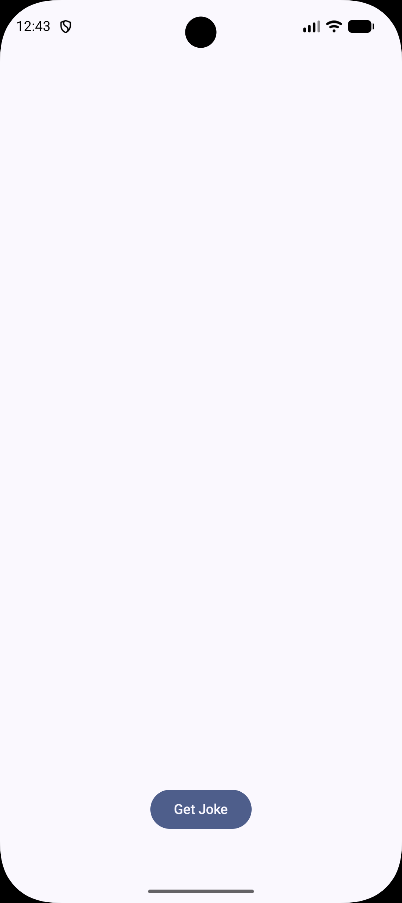
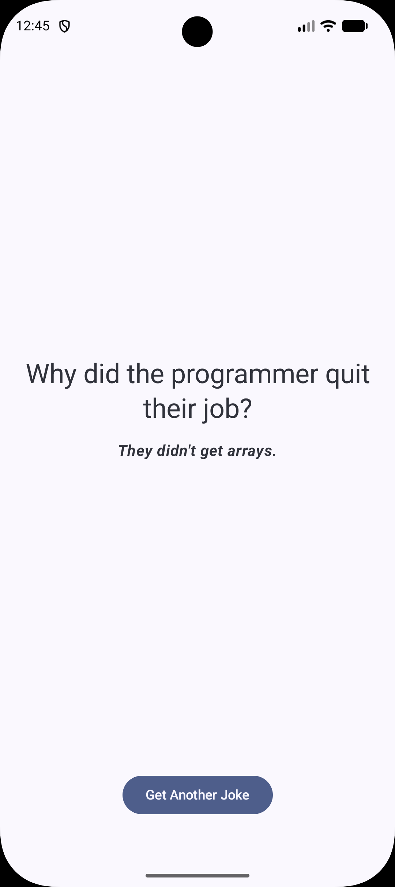

# 😂 Random Jokes App

A modern Android application that fetches random jokes from a REST API using Kotlin and Jetpack Compose.

## ✨ Features

- 😂 Get random jokes
- 🔄 Refresh to load a new joke
- ⚡ Fast and responsive UI
- ❌ Error handling
- 🌐 REST API integration

## 📱 Screenshots

Home

<p align="center">
  
</p>

<p align="center">
  
</p>

## 🛠 Tech Stack

- Kotlin
- Jetpack Compose
- MVVM
- Retrofit
- Coroutines
- StateFlow
- Material 3

## 📂 Architecture

```
Presentation
│
├── ViewModel
├── Screen
└── Components

Domain
│
├── Model
└── Repository

Data
│
├── Remote
├── DTO
└── Repository
```

## 🌐 API

This project uses the **Official Joke API**.

Documentation:
https://official-joke-api.appspot.com/

## 🚀 Getting Started

1. Clone the repository

```bash
git clone https://github.com/YOUR_USERNAME/RandomJokes.git
```

2. Open the project in Android Studio.

3. Build and run the app.

## 📄 License

This project is licensed under the MIT License.
